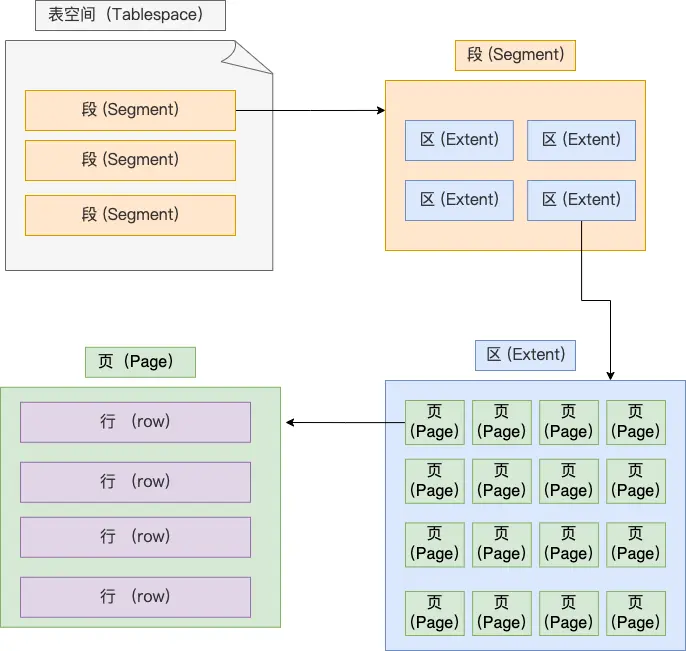

# mysql notes

## 执行一条sql语句会发生什么


mysql架构：server层和存储引擎层

* **Server 层负责建立连接、分析和执行 SQL**
* **存储引擎层负责数据的存储和提取**

连接sql服务：``mysql -u root -p`，基于TCP协议，需要进行三次握手。空闲超过`wait_timeout`后会自动断开连接。连接数量由`max_connections`控制。

步骤：

1. 建立连接。连接基于TCP
2. 查询缓存。mysql8.0后删除了缓存
3. 解析sql语句。1. 词法分析：识别关键字。2. 语法分析：判断是否符合语法，建立语法树。
4. 执行sql语句。预处理：检查表或字段是否存在、替换*。优化：确定执行方案（例如由多个索引，走哪个）。执行

## mysql记录如何进行存储

### 数据存放在哪个文件

* db.opt，用来存储当前数据库的默认字符集和字符校验规则。
* t_order.frm ，**表结构**会保存在这个文件。
* t_order.ibd，**表数据**

### 表空间结构

段区页行



## 索引的分类

- 按「数据结构」分类：**B+tree索引、Hash索引、Full-text索引**。
- 按「物理存储」分类：**聚簇索引（主键索引）、二级索引（辅助索引）**。
- 按「字段特性」分类：**主键索引、唯一索引、普通索引、前缀索引**。
- 按「字段个数」分类：**单列索引、联合索引**。

## why B+ tree

1. vs B tree：只有叶子节点存放数据，插入和删除更方便，不会影响树的结构，支持范围顺序查找
2. vs 二叉树：层数更少，查找更快
3. vs hash：可以进行范围查询

## 最左前缀法则

(a,b,c)的索引相当于3个索引：a, ab, abc

从最左边开始，不跳过中间某一列，否则部分失效

和出现的位置无关，可以乱序

使用范围查询(><)后，右边的列索引失效，尽量使用(>=,<=)

## 区分度

**建立联合索引时，要把区分度大的字段排在前面，这样区分度大的字段越有可能被更多的 SQL 使用到**

$区分度=(distinct(column)/count(*))$

## 索引失效

### 包含左边的模糊匹配

`like %xx`或者`like %xx%`

### 对索引使用函数

索引保存的是索引字段的原始值，而不是经过函数计算后的值，自然就没办法走索引了。

### 对索引进行表达式计算

```sql
explain select * from t_user where id + 1 = 10;
```

但改成id=10-1后可以使用索引

### 对索引进行隐式类型转换

**MySQL 在遇到字符串和数字比较的时候，会自动把字符串转为数字，然后再进行比较**

### 联合索引不符合最左前缀法则

### WHERE 子句中的 OR

or右侧时普通列

## 事务的特性

- **原子性（Atomicity）**：一个事务中的所有操作，要么全部完成，要么全部不完成。
- **一致性（Consistency）**：是指事务操作前和操作后，数据满足完整性约束，数据库保持一致性状态。
- **隔离性（Isolation）**：数据库允许多个并发事务同时对其数据进行读写和修改的能力，隔离性可以防止多个事务并发执行时由于交叉执行而导致数据的不一致，因为多个事务同时使用相同的数据时，不会相互干扰，每个事务都有一个完整的数据空间，对其他并发事务是隔离的。
- **持久性（Durability）**：事务处理结束后，对数据的修改就是永久的，即便系统故障也不会丢失。

## 事务三种问题

### 脏读

**如果一个事务「读到」了另一个「未提交事务修改过的数据」，就意味着发生了「脏读」现象**

**如果在上面这种情况事务 A 发生了回滚，那么事务 B 刚才得到的数据就是过期的数据，这种现象就被称为脏读。**

### 幻读

**在一个事务内多次查询某个符合查询条件的「记录数量」，如果出现前后两次查询到的记录数量不一样的情况，就意味着发生了「幻读」现象。**

主要是别人进行了数据插入

### 不可重复读

**在一个事务内多次读取同一个数据，如果出现前后两次读到的数据不一样的情况，就意味着发生了「不可重复读」现象。**

## 隔离级别


解决幻读：

- 针对**快照读**（普通 select 语句），是**通过 MVCC 方式解决了幻读**，因为可重复读隔离级别下，事务执行过程中看到的数据，一直跟这个事务启动时看到的数据是一致的，即使中途有其他事务插入了一条数据，是查询不出来这条数据的，所以就很好了避免幻读问题。
- 针对**当前读**（select ... for update 等语句），是**通过 next-key lock（记录锁+间隙锁）方式解决了幻读**，因为当执行 select ... for update 语句的时候，会加上 next-key lock，如果有其他事务在 next-key lock 锁范围内插入了一条记录，那么这个插入语句就会被阻塞，无法成功插入，所以就很好了避免幻读问题。

隔离级别如何实现：

- 对于「读未提交」隔离级别的事务来说，因为可以读到未提交事务修改的数据，所以直接读取最新的数据就好了；
- 对于「串行化」隔离级别的事务来说，通过加读写锁的方式来避免并行访问；
- 对于「读提交」和「可重复读」隔离级别的事务来说，它们是通过 **Read View **来实现的，它们的区别在于创建 Read View 的时机不同，可以把 Read View 理解成一个数据快照，就像相机拍照那样，定格某一时刻的风景。**「读提交」隔离级别是在「每个语句执行前」都会重新生成一个 Read View，而「可重复读」隔离级别是「启动事务时」生成一个 Read View，然后整个事务期间都在用这个 Read View**。

==MVCC：1. 隐藏字段。2. Undo log 版本链。3. ReadView==

==MVCC+锁，实现事务的隔离性==

==redo log+undo log，实现事务的一致性==

==redo log，实现持久性==

## 锁

### 全局锁

```sql
flush tables with read lock
```

```sql
unlock tables
```

加锁后数据库处于只读状态

### 表级锁

- 表锁；
- 元数据锁（MDL）;
- 意向锁；
- AUTO-INC 锁；