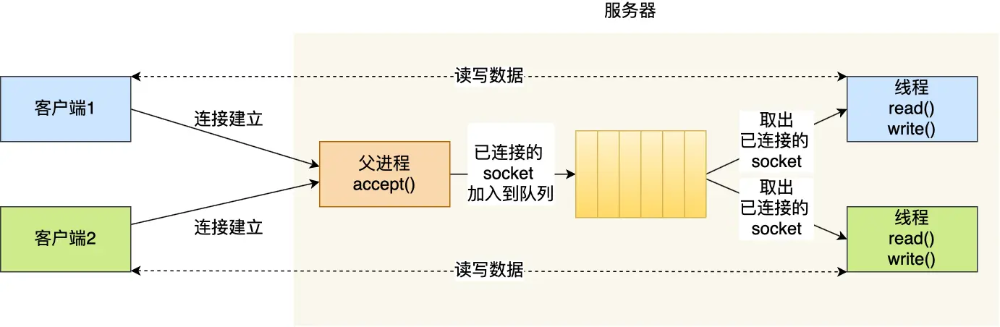

# OS

## C++中，一个线程挂掉，整个进程挂掉，JAVA不会

## 进程与线程的对比

- 进程是资源（包括内存、打开的文件等）分配的单位，线程是 CPU 调度的单位；
- 进程拥有一个完整的资源平台，而线程只独享必不可少的资源，如寄存器和栈；
- 线程同样具有就绪、阻塞、执行三种基本状态，同样具有状态之间的转换关系；
- 线程能减少并发执行的时间和空间开销；

对于，线程相比进程能减少开销，体现在：

- 线程的创建时间比进程快，因为进程在创建的过程中，还需要资源管理信息，比如内存管理信息、文件管理信息，而线程在创建的过程中，不会涉及这些资源管理信息，而是共享它们；
- 线程的终止时间比进程快，因为线程释放的资源相比进程少很多；
- 同一个进程内的线程切换比进程切换快，因为线程具有相同的地址空间（虚拟内存共享），这意味着同一个进程的线程都具有同一个页表，那么在切换的时候不需要切换页表。而对于进程之间的切换，切换的时候要把页表给切换掉，而页表的切换过程开销是比较大的；
- 由于同一进程的各线程间共享内存和文件资源，那么在线程之间数据传递的时候，就不需要经过内核了，这就使得线程之间的数据交互效率更高了；

==线程也有自己的私有数据，比如栈和寄存器等，这些在上下文切换时也是需要保存的。==

## 调度算法

1. 先来先
2. 短作业优先
3. 最高响应比优先
4. 时间片轮转
5. 最高优先级优先
6. 多级反馈队列

## 进程间通信

1. 管道：一端写入另一端读取

   **对于匿名管道，它的通信范围是存在父子关系的进程**。因为管道没有实体，也就是没有管道文件，只能通过 fork 来复制父进程 fd 文件描述符，来达到通信的目的。

   **对于命名管道，它可以在不相关的进程间也能相互通信**。因为命令管道，提前创建了一个类型为管道的设备文件，在进程里只要使用这个设备文件，就可以相互通信。

2. 消息队列：**消息队列是保存在内核中的消息链表**

3. 共享内存：**信号量其实是一个整型的计数器，主要用于实现进程间的互斥与同步，而不是用于缓存进程间通信的数据**。

4. 信号量：整形计数器，包含P操作和V操作

5. 信号：

   ```shell
   $ kill -l
    1) SIGHUP       2) SIGINT       3) SIGQUIT      4) SIGILL       5) SIGTRAP
    6) SIGABRT      7) SIGBUS       8) SIGFPE       9) SIGKILL     10) SIGUSR1
   11) SIGSEGV     12) SIGUSR2     13) SIGPIPE     14) SIGALRM     15) SIGTERM
   16) SIGSTKFLT   17) SIGCHLD     18) SIGCONT     19) SIGSTOP     20) SIGTSTP
   21) SIGTTIN     22) SIGTTOU     23) SIGURG      24) SIGXCPU     25) SIGXFSZ
   26) SIGVTALRM   27) SIGPROF     28) SIGWINCH    29) SIGIO       30) SIGPWR
   31) SIGSYS      34) SIGRTMIN    35) SIGRTMIN+1  36) SIGRTMIN+2  37) SIGRTMIN+3
   38) SIGRTMIN+4  39) SIGRTMIN+5  40) SIGRTMIN+6  41) SIGRTMIN+7  42) SIGRTMIN+8
   43) SIGRTMIN+9  44) SIGRTMIN+10 45) SIGRTMIN+11 46) SIGRTMIN+12 47) SIGRTMIN+13
   48) SIGRTMIN+14 49) SIGRTMIN+15 50) SIGRTMAX-14 51) SIGRTMAX-13 52) SIGRTMAX-12
   53) SIGRTMAX-11 54) SIGRTMAX-10 55) SIGRTMAX-9  56) SIGRTMAX-8  57) SIGRTMAX-7
   58) SIGRTMAX-6  59) SIGRTMAX-5  60) SIGRTMAX-4  61) SIGRTMAX-3  62) SIGRTMAX-2
   63) SIGRTMAX-1  64) SIGRTMAX
   ```

   

6. socket

## 互斥与同步

互斥：**保证一个线程在临界区执行时，其他线程应该被阻止进入临界区**

同步：**并发进程/线程在一些关键点上可能需要互相等待与互通消息，这种相互制约的等待与互通信息称为进程/线程同步**。

## 死锁

满足以下条件：互斥、持有并等待、不可剥夺、环路

要避免死锁，只需要破坏其中之一的条件，例如资源的有序分配

## 锁的类型

1. 互斥锁、自旋锁：互斥锁失败后回释放CPU，自旋锁会一直持有CPU

2. 读写锁：能够明确区分读写操作时使用。读锁是共享锁，写锁是独占锁。

3. 乐观锁和悲观锁：悲观锁：访问资源前先加锁；乐观锁：不加锁，如果发生冲突就放弃本次操作

## 进程调度

* 先来先服务

* 最短作业优先

* 高相应比优先

  

* 时间片轮转

* 最高优先级优先

* 多级反馈队列

## 页面置换

* 最佳页面置换，**置换在「未来」最长时间不访问的页面**。
* 先进先出
* 最近最久未使用（LRU）
* 时钟页面置换
* 最不常用（LFU）

## 零拷贝

mmap()减少从缓冲区到内存空间的拷贝（直接共享）

- 应用进程调用了 `mmap()` 后，DMA 会把磁盘的数据拷贝到内核的缓冲区里。接着，应用进程跟操作系统内核「共享」这个缓冲区；
- 应用进程再调用 `write()`，操作系统直接将内核缓冲区的数据拷贝到 socket 缓冲区中，这一切都发生在内核态，由 CPU 来搬运数据；
- 最后，把内核的 socket 缓冲区里的数据，拷贝到网卡的缓冲区里，这个过程是由 DMA 搬运的。

sendfile()：操作系统内核会从源文件中读取数据，然后将数据直接传输到目标文件描述符所关联的位置，而不需要将数据从内核复制到用户空间，再从用户空间复制到目标文件描述符。这是一种零拷贝技术，因为数据只在内核空间中移动，不涉及用户空间。

## socket

### 基础模型


在 TCP 连接的过程中，服务器的内核实际上为每个 Socket 维护了两个队列：

- 一个是「还没完全建立」连接的队列，称为 **TCP 半连接队列**，这个队列都是没有完成三次握手的连接，此时服务端处于 `syn_rcvd` 的状态；
- 一个是「已经建立」连接的队列，称为 **TCP 全连接队列**，这个队列都是完成了三次握手的连接，此时服务端处于 `established` 状态；

当 TCP 全连接队列不为空后，服务端的 `accept()` 函数，就会从内核中的 TCP 全连接队列里拿出一个已经完成连接的 Socket 返回应用程序，后续数据传输都用这个 Socket。

注意，监听的 Socket 和真正用来传数据的 Socket 是两个：

- 一个叫作**监听 Socket**；
- 一个叫作**已连接 Socket**；

### 多进程模型


### 多线程模型



## 多路复用

### select/poll

 select 这种方式，需要进行 **2 次「遍历」文件描述符集合**，一次是在内核态里，一个次是在用户态里 ，而且还会发生 **2 次「拷贝」文件描述符集合**，先从用户空间传入内核空间，由内核修改后，再传出到用户空间中。

poll 不再用 BitsMap 来存储所关注的文件描述符，取而代之用动态数组，以链表形式来组织，突破了 select 的文件描述符个数限制

select:

``` c++
int select(
    int nfds,
    fd_set *readfds,
    fd_set *writefds,
    fd_set *exceptfds,
    struct timeval *timeout);
// nfds:监控的文件描述符集里最大文件描述符加1
// readfds：监控有读数据到达文件描述符集合，传入传出参数
// writefds：监控写数据到达文件描述符集合，传入传出参数
// exceptfds：监控异常发生达文件描述符集合, 传入传出参数
// timeout：定时阻塞监控时间，3种情况
//  1.NULL，永远等下去
//  2.设置timeval，等待固定时间
//  3.设置timeval里时间均为0，检查描述字后立即返回，轮询

/* 
* select服务端伪码
* 首先一个线程不断接受客户端连接，并把socket文件描述符放到一个list里。
*/
while(1) {
    connfd = accept(listenfd);
    fcntl(connfd, F_SETFL, O_NONBLOCK);
    fdlist.add(connfd);
}
/*
* select函数还是返回刚刚提交的list，应用程序依然list所有的fd，只不过操作系统会将准备就绪的文件描述符做上标识，
* 用户层将不会再有无意义的系统调用开销。
*/
struct timeval timeout;
int max = 0;  // 用于记录最大的fd，在轮询中时刻更新即可
// 初始化比特位
FD_ZERO(&read_fd);
while (1) {
    // 阻塞获取 每次需要把fd从用户态拷贝到内核态
    nfds = select(max + 1, &read_fd, &write_fd, NULL, &timeout);
    // 每次需要遍历所有fd，判断有无读写事件发生
    for (int i = 0; i <= max && nfds; ++i) {
        // 只读已就绪的文件描述符，不用过多遍历
        if (i == listenfd) {
            // 这里处理accept事件
            FD_SET(i, &read_fd);//将客户端socket加入到集合中
        }
        if (FD_ISSET(i, &read_fd)) {
            // 这里处理read事件
        }
    }
}
```

poll:

``` c++
int poll(struct pollfd *ufds, unsigned int nfds, int timeout);
struct pollfd {
    int fd;           /*文件描述符*/
    short events;     /*监控的事件*/
    short revents;    /*监控事件中满足条件返回的事件*/
};
int poll(struct pollfd *fds, nfds_tnfds, int timeout);

// poll服务端实现伪码：
    struct pollfd fds[POLL_LEN];
unsigned int nfds=0;
fds[0].fd=server_sockfd;
fds[0].events=POLLIN|POLLPRI;
nfds++;
while {
    res=poll(fds,nfds,-1);
    if(fds[0].revents&(POLLIN|POLLPRI)) {
        //执行accept并加入fds中，nfds++
        if(--res<=0) continue
    }
    //循环之后的fds
    if(fds[i].revents&(POLLIN|POLLERR )) {
        //读操作或处理异常等
        if(--res<=0) continue
    }
}
```

### epoll

``` c++
int s = socket(AF_INET, SOCK_STREAM, 0);
bind(s, ...);
listen(s, ...);

int epfd = epoll_create(...);
epoll_ctl(epfd, ...); //将所有需要监听的socket添加到epfd中

while(1) {
    int n = epoll_wait(...);
    for(接收到数据的socket){
        //处理
    }
}
```

