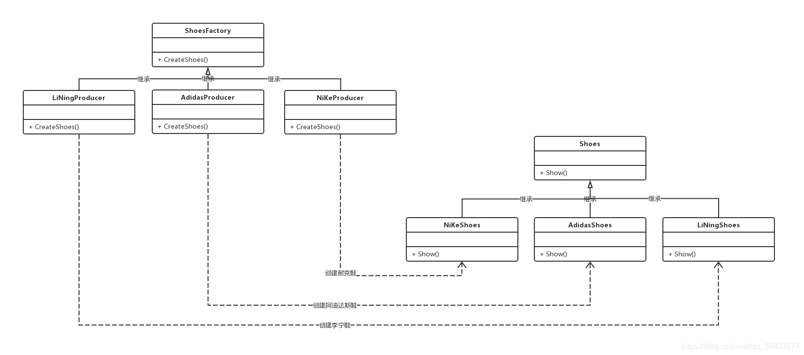

# 工厂模式

[参考链接](https://blog.csdn.net/qq_34827674/article/details/100862811)

## brief

介绍：

> 这种类型的设计模式属于创建型模式，它提供了一种创建对象的最佳方式。
> 在工厂模式中，我们在创建对象时不会对客户端暴露创建逻辑，并且是通过使用一个共同的接口来指向新创建的对象。

简单来说，使用了C++**多态**的特性，将存在**继承**关系的类，通过一个工厂类创建对应的子类（派生类）对象。在项目复杂的情况下，可以便于子类对象的创建。

工厂模式的实现方式可分别**简单工厂模式、工厂方法模式、抽象工厂模式**，每个实现方式都存在优和劣。

## 简单工厂模式


### 组成

1. 工厂类：工厂模式的核心类，会定义一个用于创建指定的具体实例对象的接口。
2. 抽象产品类：具体产品类的继承的父类或实现的接口。
3. 具体产品类：工厂类所创建的对象就是此具体产品实例。

### 特点

工厂类封装了创建具体产品对象的函数。

### 缺点

扩展性非常差，新增产品的时候，需要去修改工厂类。

### 示例

```c++
// 鞋子抽象类
class Shoes
{
public:
    virtual ~Shoes() {}
    virtual void Show() = 0;
};

// 耐克鞋子
class NiKeShoes : public Shoes
{
public:
    void Show()
    {
        std::cout << "我是耐克球鞋，我的广告语：Just do it" << std::endl;
    }
};

// 阿迪达斯鞋子
class AdidasShoes : public Shoes
{
public:
    void Show()
    {
        std::cout << "我是阿迪达斯球鞋，我的广告语:Impossible is nothing" << std::endl;
    }
};

// 李宁鞋子
class LiNingShoes : public Shoes
{
public:
    void Show()
    {
        std::cout << "我是李宁球鞋，我的广告语：Everything is possible" << std::endl;
    }
};
```

```c++
enum SHOES_TYPE
{
    NIKE,
    LINING,
    ADIDAS
};

// 总鞋厂
class ShoesFactory
{
public:
    // 根据鞋子类型创建对应的鞋子对象
    Shoes *CreateShoes(SHOES_TYPE type)
    {
        switch (type)
        {
        case NIKE:
            return new NiKeShoes();
            break;
        case LINING:
            return new LiNingShoes();
            break;
        case ADIDAS:
            return new AdidasShoes();
            break;
        default:
            return NULL;
            break;
        }
    }
};
```

```c++
int main()
{
    // 构造工厂对象
    ShoesFactory shoesFactory;

    // 从鞋工厂对象创建阿迪达斯鞋对象
    Shoes *pNikeShoes = shoesFactory.CreateShoes(NIKE);
    if (pNikeShoes != NULL)
    {
        // 耐克球鞋广告喊起
        pNikeShoes->Show();

        // 释放资源
        delete pNikeShoes;
        pNikeShoes = NULL;
    }

    // 从鞋工厂对象创建阿迪达斯鞋对象
    Shoes *pLiNingShoes = shoesFactory.CreateShoes(LINING);
    if (pLiNingShoes != NULL)
    {
        // 李宁球鞋广告喊起
        pLiNingShoes->Show();

        // 释放资源
        delete pLiNingShoes;
        pLiNingShoes = NULL;
    }

    // 从鞋工厂对象创建阿迪达斯鞋对象
    Shoes *pAdidasShoes = shoesFactory.CreateShoes(ADIDAS);
    if (pAdidasShoes != NULL)
    {
        // 阿迪达斯球鞋广告喊起
        pAdidasShoes->Show();

        // 释放资源
        delete pAdidasShoes;
        pAdidasShoes = NULL;
    }

    return 0;
}
```

```
# ./simpleFactory 
我是耐克球鞋，我的广告语：Just do it
我是阿迪达斯球鞋，我的广告语:Impossible is nothing
我是李宁球鞋，我的广告语：Everything is possible
```

## 工厂方法模式



### 组成

1. 抽象工厂类：工厂方法模式的核心类，提供创建具体产品的接口，由具体工厂类实现。
2. 具体工厂类：继承于抽象工厂，实现创建对应具体产品对象的方式。
3. 抽象产品类：它是具体产品继承的父类（基类）。
4. 具体产品类：具体工厂所创建的对象，就是此类。

### 特点

- 工厂方法模式抽象出了工厂类，提供创建具体产品的接口，交由子类去实现。
- 工厂方法模式的应用并不只是为了封装具体产品对象的创建，而是要把具体产品对象的创建放到具体工厂类实现。

### 缺点

- 每新增一个产品，就需要增加一个对应的产品的具体工厂类。相比简单工厂模式而言，工厂方法模式需要更多的类定义。
- 一条生产线只能一个产品。

## 抽象工厂模式


### 组成

1. 抽象工厂类：工厂方法模式的核心类，提供创建具体产品的接口，由具体工厂类实现。
2. 具体工厂类：继承于抽象工厂，实现创建对应具体产品对象的方式。
3. 抽象产品类：它是具体产品继承的父类（基类）。
4. 具体产品类：具体工厂所创建的对象，就是此类。

### 特点

提供一个接口，可以创建多个产品族中的产品对象。

### 缺点

同工厂方法模式一样，新增产品时，都需要增加一个对应的产品的具体工厂类。

